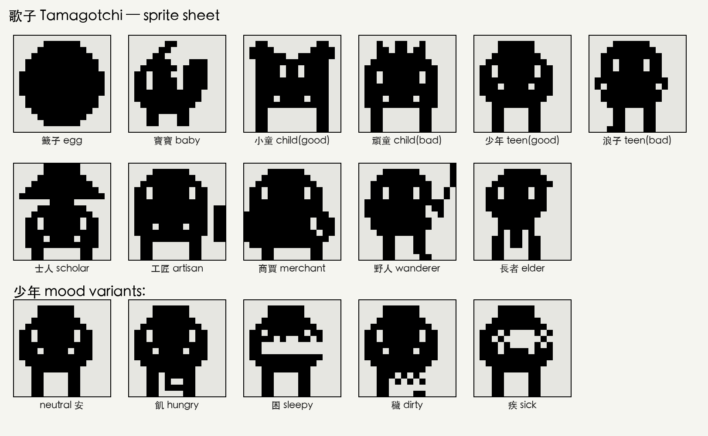
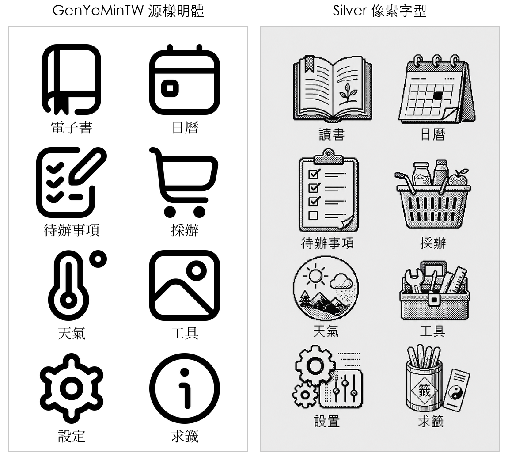

# 梅花小民
# M5Stack Paper S3 — 中文電子書閱讀器 & 農民曆
### 一個讀書人寫的讀書項目


## 簡介
一款功能豐富的中文電子墨水應用程式，專為 **M5Stack Paper S3**（ESP32-S3，540×960 4 位元灰階電子墨水螢幕）設計。結合傳統中文書籍閱讀器與完整的農民曆（老黃曆）、天氣面板、倉頡輸入法等多項功能。

## 功能特色

### 📖 電子書閱讀器 


- 支援 **TXT 與 EPUB** 格式，直排中文排版（由右至左分欄）
- EPUB 解析內建 ZIP/Deflate 解壓縮及 HTML 轉純文字擷取
- **目錄功能 (TOC)** — 透過 NCX 解析 EPUB 章節索引；分頁列表，點擊即可跳至對應章節；TXT 或無目錄的 EPUB 則顯示「此書無目錄」提示
- **圖標工具列** — 預渲染圖標條含 6 個觸控按鈕：縮小字型 (−A)、字型大小顯示、放大字型 (+A)、字型選單 (Aa)、目錄 (≡)、書籤 (★)
- 可調整字體大小（20–64px），切換字體大小時保持閱讀位置
- **智慧字型縮放** — Silver 字型自動依比例放大以匹配 GenYoMinTW 的視覺大小，並以更緊密的垂直字距優化閱讀體驗
- **逐字精準對齊** — 每個字元皆量測實際寬高並水平及垂直置中於字面框內，確保直排文字對齊精確
- 閱讀進度自動儲存至 SD 卡（`.pos` 附屬檔案）
- 書籤功能（每本書最多 5 個書籤，儲存為 `.bm` 檔案）
- **中文字型篩選** — 字型選擇列表自動隱藏純英文字型，透過 OS/2 表格（TTF）或字形索引取樣（BIN）偵測 CJK 支援
- **二進位字型預覽** — 字型選單使用實際字型字形渲染 .bin 字型樣本，而非系統字型
- 支援多種字型：TTF、TTC、OTF 及預渲染 BIN 字型

### 📅 農民曆 
完整的傳統農民曆功能：
- **陽曆轉陰曆** — 涵蓋 1900–2100 年的查表轉換
- **天干地支** — 年柱、月柱、日柱（八字）
- **二十四節氣** — 兩種計算方式：
  - **Meeus 天文算法** — 精確度約 1 分鐘
  - **壽星天文曆 (sxwnl)** — 許劍偉的開源算法，可在設定中切換
- **生肖** — 依據干支年份
- **納音五行** — 六十甲子循環查表
- **宜/忌** — 每日宜忌事項
- **喜神/福神/財神方位** — 依據日干的吉神方位
- **胎神** — 傳統懷孕禁忌方位
- **彭祖百忌** — 依據天干/地支的每日禁忌
- **時辰吉凶** — 十二時辰干支及吉凶指示
- **沖煞** — 每日生肖沖煞
- **六曜** — 每日運勢循環
- **節日** — 道教、民俗及佛教節日
- **朔/望標記** — 新月與滿月指示
- 日期選擇器含月曆網格及年月選擇器

### 🌤️ 天氣面板  
- **OpenWeatherMap API** 整合
- 目前天氣：溫度、濕度、風速、氣壓、能見度
- 三日天氣預報含最高/最低溫
- 空氣品質指數 (AQI)：PM2.5、PM10、O₃、NO₂、CO
- 中文天氣描述及品質標籤（優/良/中/差/很差）
- 日出/日落時間
- 天氣圖標以程式繪製
- 每 15 分鐘自動更新

### ⌨️ 倉頡輸入法 
- 螢幕觸控鍵盤輸入倉頡字根碼
- 候選字列表含分頁
- 用於待辦事項及購物清單的新增
- 二進位字典查詢自 `cangjie5.dict.yaml`

### 📝 待辦事項 & 購物清單 
- CSV 格式儲存於 SD 卡
- 勾選狀態持久化
- 購物清單含分組標題
- 待辦事項含日期欄位
- 倉頡輸入法新增項目

### 🎋 求籤 
- **觀音靈籖** — 100 支觀音靈籤，搖晃裝置抽籤
- **淺草寺靈籖** — 100 支淺草寺靈籤
- 搖晃裝置抽籤（加速度感測器偵測）
- 預封裝二進位格式 (FSLP) 快速載入
- 籤詩圖片來源：[www.chance.org.tw](https://www.chance.org.tw)
- **歌子靈籖** — 隱藏彩蛋，內建一隻名為「歌子」的電子寵物。狀態依實際時間衰退，
  存於 SD 卡 `/tamagotchi.dat`；提供 餵食 / 逗玩 / 清掃 / 醫治 四種動作，
  具備疾病與以「德」為分支條件的成長樹
  （籖子 → 寶寶 → 小童／頑童 → 少年／浪子 → 士人／工匠／商賈／野人 → 長者）。

  

### 🖼️ 桌布瀏覽器 
- 瀏覽並顯示 SD 卡中的 JPG 桌布
- 全螢幕電子墨水顯示

### 🔐 BLE 近距離解鎖  
- 依據 BLE 距離自動鎖定/解鎖 Mac
- Paper S3 作為被動 BLE 信標（無需配對）
- macOS 配套腳本監控 RSSI 訊號強度
- 密碼安全儲存於 macOS 鑰匙圈（不會存於設定檔）
- 可配置鎖定/解鎖 RSSI 門檻與時間設定
- 可安裝為 macOS LaunchAgent 自動啟動

### 💤 睡眠模式與每日格言 
- 深度睡眠含觸控喚醒（GPIO 21）
- 顯示 `/mottos.txt` 中的隨機格言（檔案不存在時使用 10 則內建預設）
- 透過 RTC 常駐變數保存深度睡眠期間的狀態

### ⚙️ 設定 
- **WiFi** — 掃描網路、螢幕鍵盤輸入密碼
- **時區** — 20 多種預設（亞洲、美洲、歐洲等）
- **網頁伺服器** — HTTP 檔案管理器，可瀏覽/上傳/下載/刪除 SD 卡檔案
- **USB 大容量儲存** — 將 SD 卡作為 USB 磁碟直接存取檔案（MSC 期間自動關閉 WiFi）
- **圖標來源** — SD 卡（可自訂）或內建（開機較快）
- **曆法計算** — Meeus 算法 vs 壽星天文曆算法
- **系統字型** — GenYoMinTW（預設）或 Silver（像素風格）；Silver 標籤以逐尺寸縮放因子預渲染，兩種字型產生一致的視覺大小：

主畫面對比：



## 硬體

- **M5Stack Paper S3**
  - ESP32-S3 @ 240MHz
  - 540×960 電子墨水螢幕，4 位元灰階（16 色階）
  - 電容式觸控
  - OPI PSRAM
  - SD 卡插槽
  - USB-C

## 編譯與燒錄

### 先決條件

- [PlatformIO](https://platformio.org/)（VS Code 擴充功能或命令列工具）

### 編譯

```bash
pio run
```

### 上傳

透過 USB-C 連接 M5Stack Paper S3，然後：

```bash
pio run -t upload
```

### 燒錄預編譯韌體

從 [Releases](https://github.com/yuleshow/M5Stack-Paper-S3-Chinese-Books/releases) 頁面下載韌體。提供兩種版本：

**16 MB 合併韌體**（建議用於全新/空白裝置 — 包含 bootloader + 分區表 + 應用程式）：

```bash
esptool.py --chip esp32s3 --port /dev/cu.usbmodem* write_flash 0x0 M5Paper-S3-Chinese-Books-*-merged.bin
```

**8 MB 純應用程式韌體**（適用於已有 bootloader 和分區表的裝置）：

```bash
esptool.py --chip esp32s3 --port /dev/cu.usbmodem* write_flash 0x10000 M5Paper-S3-Chinese-Books-*-app-only.bin
```

> **連接埠：** macOS → `/dev/cu.usbmodem*` · Linux → `/dev/ttyACM0` · Windows → `COM3`（請查看裝置管理員）

### 相依套件（PlatformIO 自動安裝）

- `m5stack/M5Unified@^0.2.13`
- [OpenFontRender](https://github.com/takkaO/OpenFontRender)
- `espressif32@6.5.0`（Arduino 框架）

### BLE 近距離解鎖（macOS 配套程式）

Paper S3 會以 BLE 信標方式廣播。macOS 配套腳本監控訊號，依據距離自動鎖定/解鎖 Mac。

**1. 在裝置上啟用 BLE** — 在 SD 卡的 `config.ini` 中加入：

```ini
[unlock]
enabled=true
device_name=M5Paper-BLE
```

無需配對 — 裝置只需開啟廣播即可。

**2. 安裝並執行配套腳本：**

```bash
pip install bleak
python3 scripts/ble_unlock.py --password '你的Mac密碼'
```

密碼會儲存至 **macOS 鑰匙圈**（不會存於任何檔案中）。之後執行無需再輸入 `--password`：

```bash
python3 scripts/ble_unlock.py
```

**3.（選用）安裝為背景服務：**

```bash
python3 scripts/ble_unlock.py --install-service
```

這會建立 macOS LaunchAgent，登入時自動啟動。密碼從鑰匙圈讀取。

**選項：**

| 參數 | 預設值 | 說明 |
|------|--------|------|
| `--password` | — | Mac 登入密碼（儲存至鑰匙圈） |
| `--name` | `M5Paper-BLE` | 要監控的 BLE 裝置名稱 |
| `--lock-threshold` | `-85` | RSSI 低於此值觸發鎖定 |
| `--unlock-threshold` | `-70` | RSSI 高於此值觸發解鎖 |
| `--lock-delay` | `15` | 離開多少秒後鎖定 |
| `--scan-interval` | `3` | BLE 掃描間隔秒數 |
| `--debug` | — | 啟用詳細日誌 |

## 字型轉換（TTF → BIN）

預渲染 BIN 字型在 ESP32-S3 上載入速度遠快於 TTF。批次轉換所有內建字型：

```bash
bash scripts/compile_all_bins.sh
```

或轉換單一字型：

```bash
python3 scripts/convert_ttf_to_bin.py sd_card/fonts/MingLiU.ttf sd_card/fonts/MingLiU.bin 44
```

轉換器功能：
- **備用字型借取** — 缺失的字形（如直排標點符號）會自動從 GenYoMinTW 借取
- **直排括號旋轉** — 水平括號字形會順時針旋轉 90° 以合成缺失的直排形式
- **渲染尺寸縮放** — Silver 等字型可以較大尺寸渲染（如 61px），同時在標頭中儲存較小的方格尺寸（44px），以達到視覺大小匹配
- **TTC 合集支援** — 正確讀取 TrueType Collection（.ttc）檔案的 cmap，指定字型面索引
- **GUI 模式** — 使用 `--gui` 啟動圖形介面，具備 CJK 字型篩選、可捲動字型清單、備用字形數量警告及批次轉換
- **macOS 應用程式** — 預建的 `FontConverterBIN.app` 和 `.dmg` 位於 `dist/`；使用 `bash scripts/build_mac_app.sh` 建置

詳見 [`scripts/README-chinese.md`](scripts/README-chinese.md) 了解所有可用腳本。
