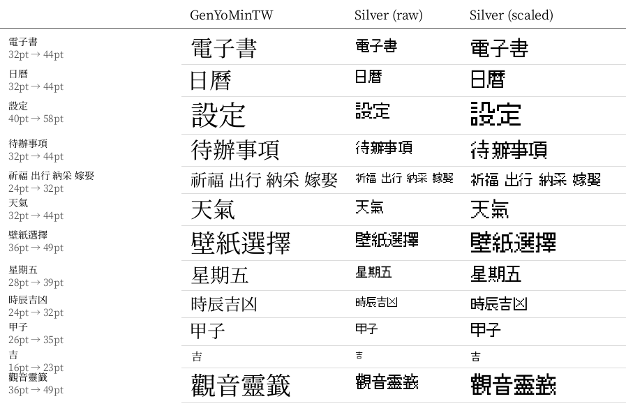
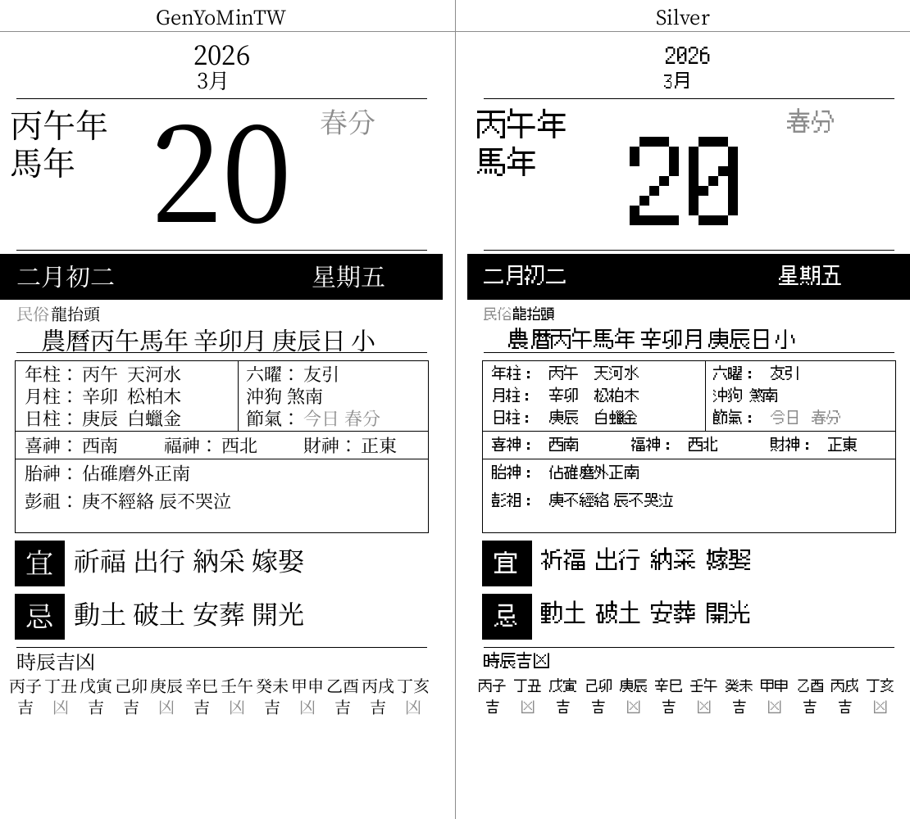

# 梅花小民
# M5Stack Paper S3 — Chinese Book Reader & Almanac Calendar


## Overview
A feature-rich Chinese e-ink application for the **M5Stack Paper S3** (ESP32-S3, 540×960 4-bit grayscale e-ink display). Combines a traditional Chinese book reader with a full-featured Chinese almanac calendar (農民曆/老黃曆), weather dashboard, Cangjie input method, and more.

## Features

### 📖 Book Reader 


- **TXT and EPUB** support with vertical CJK text layout (right-to-left columns)
- EPUB parsing with built-in ZIP/deflate decompression and HTML-to-text extraction
- **Table of Contents (TOC)** — NCX-based chapter index for EPUB files; paginated list with tap-to-jump navigation; shows "此書無目錄" popup for TXT or EPUBs without TOC
- **Bitmap toolbar** — Pre-rendered icon strip with 6 touch buttons: font decrease (−A), font size display, font increase (+A), font menu (Aa), index/TOC (≡), bookmark (★)
- Configurable font size (20–64px), page position preserved across font size changes
- **Smart font scaling** — Silver font automatically enlarged using per-size scale factors to match GenYoMinTW visual size, with tighter vertical character spacing for optimal readability
- **Per-character centering** — Each glyph is measured and centered both horizontally and vertically within its em-square cell for precise vertical text alignment
- Reading position auto-saved to SD card (`.pos` sidecar files)
- Bookmarks support (up to 5 per book, saved as `.bm` files)
- **CJK font filtering** — Font selection list automatically hides English-only fonts by detecting CJK support via OS/2 table (TTF) or glyph index sampling (BIN)
- **Binary font preview** — Font menu renders .bin font samples using actual font glyphs instead of system font
- Multiple font support: TTF, TTC, OTF, and pre-rendered BIN fonts

### 📅 Chinese Almanac Calendar (農民曆) 
A complete traditional Chinese almanac with:
- **Solar-to-Lunar conversion** — Lookup table covering 1900–2100
- **天干地支 (Heavenly Stems & Earthly Branches)** — Year, month, and day pillars (八字)
- **24 Solar Terms (二十四節氣)** — Two calculation methods:
  - **Meeus astronomical algorithm** — Accurate to ~1 minute
  - **壽星天文曆 (sxwnl)** — 許劍偉's open-source algorithm, selectable in settings
- **生肖 (Zodiac animals)** — Based on 干支 year
- **納音五行 (NaYin Five Elements)** — 60 Jiazi cycle lookup
- **宜/忌 (Auspicious / Inauspicious activities)** — Daily dos and don'ts
- **喜神/福神/財神方位** — Lucky god directions based on day stem
- **胎神 (Fetal god position)** — Traditional pregnancy taboos
- **彭祖百忌** — Daily taboos from 天干/地支
- **時辰吉凶** — 12 two-hour period GanZhi with fortune indicators
- **沖煞 (Clash animals)** — Daily zodiac clash
- **六曜 (Rokuyo)** — Daily fortune cycle
- **節日 (Festivals)** — 道教, 民俗, and 佛教 festivals
- **朔/望 markers** — New moon and full moon indicators
- Date picker with month calendar grid and year/month selector

### 🌤️ Weather Dashboard  
- **OpenWeatherMap API** integration
- Current conditions: temperature, humidity, wind, pressure, visibility
- 3-day forecast with min/max temperatures
- Air Quality Index (AQI) with PM2.5, PM10, O₃, NO₂, CO readings
- Chinese weather descriptions and quality labels (優/良/中/差/很差)
- Sunrise/sunset times
- Weather icons drawn programmatically
- Auto-refresh every 15 minutes

### ⌨️ Cangjie Input Method (倉頡輸入法) 
- On-screen touch keyboard for Cangjie radical codes
- Candidate character list with pagination
- Used for adding items to Todo and Shopping lists
- Binary dictionary lookup from `cangjie5.dict.yaml`

### 📝 Todo & Shopping Lists 
- CSV-based storage on SD card
- Checkbox persistence
- Shopping list with group headers
- Todo list with date fields
- Cangjie input for adding new items

### 🎋 Fortune Slips (求籤) 
- **觀音靈籖** — 100 Guanyin fortune slips with IMU shake-to-draw
- **淺草寺靈籖** — 100 Sensoji temple fortune slips
- Shake the device to draw a slip (accelerometer-based detection)
- Pre-packed binary format (FSLP) for fast SD card loading
- Fortune slip images sourced from [www.chance.org.tw](https://www.chance.org.tw)

### 🖼️ Wallpaper Browser 
- Browse and display JPG wallpapers from SD card
- Full-screen e-ink display

### 🔐 BLE Proximity Unlock  
- Auto-lock/unlock your Mac based on BLE proximity
- Paper S3 acts as a passive BLE beacon (no pairing required)
- macOS companion script monitors RSSI signal strength
- Password stored securely in macOS Keychain (never in config files)
- Configurable lock/unlock RSSI thresholds and timing
- Installable as a macOS LaunchAgent for auto-start

### 💤 Sleep Mode with Daily Mottos 
- Deep sleep with touch wake-up (GPIO 21)
- Displays a random motto from `/mottos.txt` (10 built-in defaults if file missing)
- Preserves state across deep sleep via RTC-persistent variables

### ⚙️ Settings 
- **WiFi** — Network scanning, on-screen keyboard for password
- **Timezone** — 20+ presets (Asia, Americas, Europe, etc.)
- **Web Server** — HTTP file manager for browsing/uploading/downloading/deleting files on SD card
- **USB Mass Storage** — Expose SD card as USB drive for direct file access (WiFi auto-disabled during MSC)
- **Icon Source** — SD card (customizable) or embedded (faster boot)
- **Calendar Method** — Meeus vs 壽星天文曆 algorithm
- **System Font** — GenYoMinTW (default) or Silver (pixel-style); Silver labels are pre-rendered with per-size scale factors so both fonts produce matching visual sizes:



Calendar page comparison (March 20, 2026 — 農曆二月初二，春分):



## Hardware

- **M5Stack Paper S3**
  - ESP32-S3 @ 240MHz
  - 540×960 e-ink display, 4-bit grayscale (16 levels)
  - Capacitive touch
  - OPI PSRAM
  - SD card slot
  - USB-C

## Build & Flash

### Prerequisites

- [PlatformIO](https://platformio.org/) (VS Code extension or CLI)

### Build

```bash
pio run
```

### Upload

Connect the M5Stack Paper S3 via USB-C, then:

```bash
pio run -t upload
```

### Flash Pre-built Binary

Download binaries from the [Releases](https://github.com/yuleshow/M5Stack-Paper-S3-Chinese-Books/releases) page. Two versions are provided:

**16 MB merged binary** (recommended for fresh/blank devices — includes bootloader + partition table + app):

```bash
esptool.py --chip esp32s3 --port /dev/cu.usbmodem* write_flash 0x0 M5Paper-S3-Chinese-Books-*-merged.bin
```

**8 MB app-only binary** (for devices that already have the bootloader and partition table):

```bash
esptool.py --chip esp32s3 --port /dev/cu.usbmodem* write_flash 0x10000 M5Paper-S3-Chinese-Books-*-app-only.bin
```

> **Port:** macOS → `/dev/cu.usbmodem*` · Linux → `/dev/ttyACM0` · Windows → `COM3` (check Device Manager)

### Dependencies (auto-installed by PlatformIO)

- `m5stack/M5Unified@^0.2.13`
- [OpenFontRender](https://github.com/takkaO/OpenFontRender)
- `espressif32@6.5.0` (Arduino framework)

### BLE Proximity Unlock (macOS companion)

The Paper S3 broadcasts as a BLE beacon. A macOS companion script monitors the signal and automatically locks/unlocks your Mac based on proximity.

**1. Enable BLE on the device** — add to `config.ini` on SD card:

```ini
[unlock]
enabled=true
device_name=M5Paper-BLE
```

No pairing required — the device just needs to be advertising.

**2. Install and run the companion script:**

```bash
pip install bleak
python3 scripts/ble_unlock.py --password 'YOUR_MAC_PASSWORD'
```

The password is saved to **macOS Keychain** (not stored in any file). Subsequent runs don't need `--password`:

```bash
python3 scripts/ble_unlock.py
```

**3. (Optional) Install as a background service:**

```bash
python3 scripts/ble_unlock.py --install-service
```

This creates a macOS LaunchAgent that auto-starts on login. Password is read from Keychain.

**Options:**

| Flag | Default | Description |
|------|---------|-------------|
| `--password` | — | Mac login password (saved to Keychain) |
| `--name` | `M5Paper-BLE` | BLE device name to monitor |
| `--lock-threshold` | `-85` | RSSI below this triggers lock |
| `--unlock-threshold` | `-70` | RSSI above this triggers unlock |
| `--lock-delay` | `15` | Seconds of absence before locking |
| `--scan-interval` | `3` | Seconds between BLE scans |
| `--debug` | — | Enable verbose logging |

See `python3 scripts/ble_unlock.py --help` for all options.

## SD Card Setup

Place the following files on the SD card:

| Path | Required | Description |
|------|----------|-------------|
| `config.ini` | Recommended | WiFi, timezone, and weather API configuration |
| `fonts/GenYoMinTW-Regular.ttf` | Recommended | System UI font (any TTF/TTC works as fallback) |
| `books/*.txt` | Optional | Plain text books (UTF-8 encoded) |
| `books/*.epub` | Optional | EPUB e-books |
| `mottos.txt` | Optional | One motto per line for sleep screen |
| `shopping_list.csv` | Optional | Shopping list (`group\|item` format) |
| `todo_list.csv` | Optional | Todo list (`date,task` format) |
| `wallpapers/*.jpg` | Optional | JPG wallpapers |
| `icons/icon1.png`–`icon8.png` | Optional | Custom dashboard icons (PNG) |
| `weather.cfg` | Optional | Alternative weather-only config |

### Configuration

Copy `assets/config.ini.example` to SD card as `config.ini` and fill in your details:

```ini
[wifi]
ssid=YOUR_WIFI_SSID
password=YOUR_WIFI_PASSWORD

[time]
timezone=PST8PDT
gmtoffset=-28800

[weather]
apikey=YOUR_OPENWEATHERMAP_API_KEY
city=YOUR_CITY,YOUR_COUNTRY
units=metric
```

Get a free API key at [OpenWeatherMap](https://openweathermap.org/api).

## Architecture

### Pre-Rendered Bitmap Font System 

All static Chinese UI text is **pre-rendered at build time** into 4-bit grayscale bitmap C headers using `scripts/convert_labels.py`. This eliminates runtime font rendering for UI elements, providing instant text display on the e-ink screen.

- `scripts/convert_labels.py` renders ~1200 label strings at various sizes → individual `.h` files in `src/labels/`
- `findLabelBitmap()` provides O(1) lookup by text + size
- `drawSystemText()` tries bitmap first, falls back to TTF rendering

### Key Source Files

| File | Description |
|------|-------------|
| `main.cpp` | Entry point, touch routing, mode switching, deep sleep |
| `globals.h` / `globals.cpp` | Shared types, enums, constants, extern declarations |
| `calendar.cpp` | Full Chinese almanac: lunar conversion, 八字, 節氣, 宜忌 |
| `book_reader.cpp` | TXT reader with vertical CJK layout |
| `epub_reader.cpp` | EPUB ZIP parsing, HTML extraction, deflate decompression |
| `weather.cpp` | OpenWeatherMap integration with bitmap-rendered UI |
| `cangjie_input.cpp` | On-screen Cangjie Chinese input method |
| `font_manager.cpp` | Font scanning, TTF name extraction, OpenFontRender I/O |
| `setup_ui.cpp` | Settings screens and analog clock |
| `ui_drawing.cpp` | Status bar, nav bar, system text rendering |
| `wifi_config.cpp` | WiFi config, NTP sync, timezone management |
| `web_server_handler.cpp` | HTTP file manager |
| `usb_msc_handler.cpp` | USB Mass Storage mode |
| `dashboard.cpp` | Welcome screen and 2×4 icon dashboard |
| `scripts/convert_labels.py` | Build tool: renders Chinese strings to bitmap headers |

### Build Stats

- Flash: ~46% of 8MB
- RAM: ~33% of 320KB
- ~1200 pre-rendered bitmap labels (~1 MB)

## Regenerating Label Bitmaps

If you modify UI strings or add new labels, regenerate the bitmap headers:

```bash
python3 scripts/convert_labels.py
```

Requires Python 3 with `Pillow` and a TTF font (default: `assets/fonts/GenYoMinTW-Regular.ttf`).

## Converting Fonts (TTF → BIN)

Pre-rendered BIN fonts load much faster than TTF on the ESP32-S3. To convert all bundled fonts:

```bash
bash scripts/compile_all_bins.sh
```

Or convert a single font:

```bash
python3 scripts/convert_ttf_to_bin.py sd_card/fonts/MingLiU.ttf sd_card/fonts/MingLiU.bin 44
```

Features of the converter:
- **Fallback font borrowing** — Missing glyphs (e.g. vertical punctuation) are automatically borrowed from GenYoMinTW if available
- **Vertical bracket rotation** — Horizontal bracket characters are rotated 90° CW to synthesize missing vertical forms
- **Render-size scaling** — Fonts like Silver can be rendered at a larger size (e.g. 61px) while storing a smaller grid size (44px) in the header for visual size matching
- **TTC collection support** — Correctly reads cmap from TrueType Collection (.ttc) files by specifying the font face index
- **GUI mode** — Run with `--gui` for a graphical interface with CJK-only font filtering, scrollable font list, fallback glyph count warnings, and batch conversion
- **macOS app** — Pre-built `FontConverterBIN.app` and `.dmg` available in `dist/`; build with `bash scripts/build_mac_app.sh`

See [`scripts/README.md`](scripts/README.md) for all available scripts.

## License

This project is licensed under the [GNU General Public License v2.0](LICENSE).

## Documentation

See the **[User Guide](docs/USER_GUIDE.md)** for detailed setup instructions, feature walkthroughs, and troubleshooting.

## Acknowledgments

- [壽星天文曆 (sxwnl)](https://github.com/sxwnl) by 許劍偉 — Chinese astronomical calendar algorithms
- [OpenFontRender](https://github.com/takkaO/OpenFontRender) by takkaO — TTF font rendering for embedded systems
- [M5Unified](https://github.com/m5stack/M5Unified) by M5Stack — Hardware abstraction library
- [OpenWeatherMap](https://openweathermap.org/) — Weather data API
- Jean Meeus, *Astronomical Algorithms* — Solar longitude calculations
