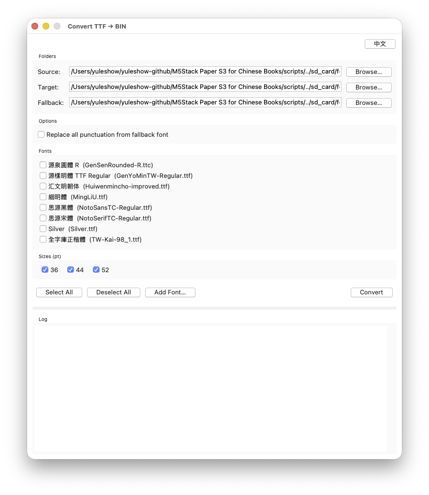

# 腳本工具


Python 建置工具與資產轉換及分析公用程式。

## 轉換腳本 

這些腳本將資產轉換為 C 標頭檔或二進位格式，用於嵌入韌體：

| 腳本 | 說明 |
|------|------|
| `convert_labels.py` | 將中文 UI 字串渲染為 4 位元灰階點陣圖 C 標頭檔（`src/labels/`）。核心建置工具 — 產生約 1200 個預渲染標籤點陣圖。 |
| `convert_cover.py` | 將 `assets/s3cover.jpg` 開機啟動畫面轉換為 C 標頭檔（`src/s3cover_jpg.h`） |
| `convert_sleeping.py` | 將 `assets/sleeping.jpg` 睡眠畫面圖片轉換為 C 標頭檔（`src/sleeping_jpg.h`） |
| `convert_icons.py` | 將 `assets/icons/` 中的 PNG 圖標轉換為 `src/icons/` 中的 C 標頭檔 |
| `convert_cangjie.py` | 將 `data/cangjie5.dict.yaml` 轉換為二進位查詢格式（`assets/cangjie5.bin`） |
| `convert_ttf_to_bin.py` | 將 TTF 字型轉換為預渲染 BIN 格式以加速載入。支援備用字型借取缺失字形，以及渲染尺寸縮放（如 Silver 以 61px 渲染 → 44px 方格）。自動將水平括號字形順時針旋轉 90° 以合成缺失的直排形式。每個字形均在字面框內水平及垂直置中。正確讀取 TTC 合集檔案的 cmap。使用 `--gui` 啟動圖形介面。 |

### 字型轉換器 GUI



執行 `python3 convert_ttf_to_bin.py --gui` 啟動圖形化轉換器。支援中英語言切換、字型預覽、備用字型選擇及批次轉換。功能包括：
- **CJK 字型篩選** — 自動隱藏僅含英文的字型
- **可捲動字型清單** — 支援大量字型集合的捲動區域與滑鼠滾輪
- **備用字形警告** — 當超過 50% 字形來自備用字型時發出警告（表示字型讀取問題）
- **macOS 應用程式** — 使用 `bash scripts/build_mac_app.sh` 建置獨立 `.app` 和 `.dmg`

| 腳本 | 說明 |
|------|------|
| `compile_all_bins.sh` | 批次編譯所有 TTF 字型為 BIN 格式，使用 `convert_ttf_to_bin.py`。自動處理 Silver 的渲染尺寸縮放。 |

## 分析與測試腳本 

| 腳本 | 說明 |
|------|------|
| `analyze_labels.py` | 分析標籤圖片渲染以供除錯 |
| `analyze_cangjie.py` | 分析倉頡字典（字元數量、碼分佈） |
| `check_missing_chars.py` | 檢查字型二進位檔中缺失的字元 |
| `check_vert_punct.py` | 檢查各字型的直排標點符號字形覆蓋率 |
| `test_font_header.py` | 測試並驗證產生的字型標頭檔 |
| `verify_bazi.py` | 驗證八字計算是否與參考資料一致 |

## 使用方式

所有腳本會自動偵測專案根目錄，因此可在任何位置執行：

```bash
# 從專案根目錄
python3 scripts/convert_labels.py

# 或從腳本目錄
cd scripts && python3 convert_labels.py
```

## 需求

- Python 3
- `Pillow`（PIL）— 用於圖片和字型渲染
- TTF 字型檔（預設：`assets/fonts/GenYoMinTW-Regular.ttf`）
